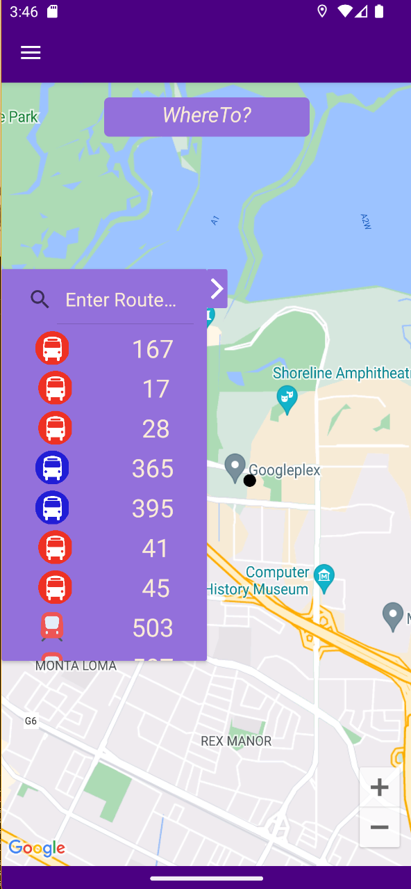
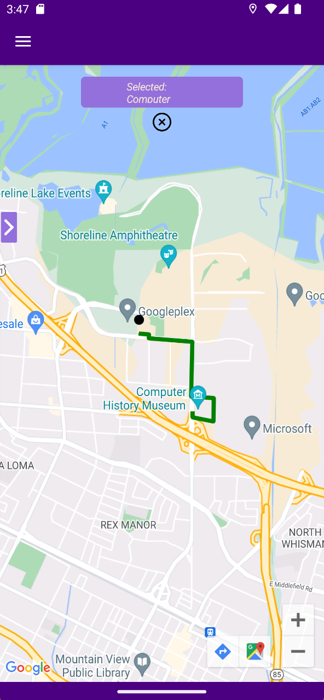

# WhereTo? A Toronto-Based Transit Application
#### DESCRIPTION
`WhereTo?` was a project I created to learn more about **Microsoft Azure** as well as **Xamarin.Forms / Google APIs** and how they work.

This is a TTC Vehicle / Route tracker that will show you the routes and vehicles of the Toronto Transit Commission, alongisde showing a route to a destination of your choosing. All of this is free to use!

#### APP UTILIZATIONS
- Azure SQL Database
- Azure Data Factory
- Xamarin.Forms
- Google Maps API
- Azure Web / Function Apps
- TTC Information

#### HOW TO USE
- Load up Visual Studio
- Boot up your Android device / emulator
- Connect it to Visual studio (Device: by USB, Emulator: Visual Studio's built-in emulator)
- Click "Start" or "Run", and you got it working!

### SAMPLE IMAGES
#### *Home Screen*

#### *Vehicle Screen*

#### *Vehicle Search Screen*

#### *TTC Route List + Live Vehicle Tracking*

#### *Route Search Screen Before Text*

#### *Route Search Screen After Text*

#### *Route Navigation*
